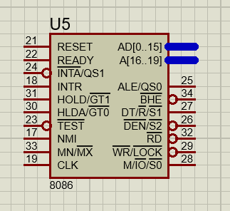
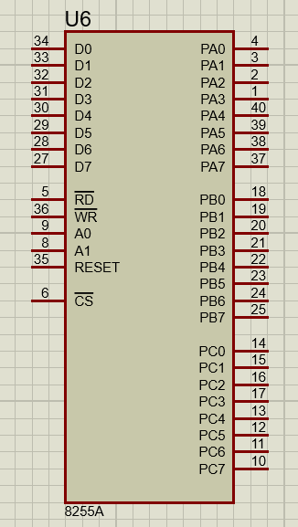
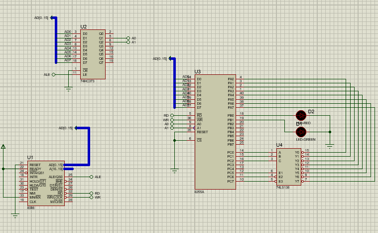

# IC Tester

The IC Tester is a project developed in assembly language for the 8086 microprocessor using Proteus simulation software. This project is designed to test 74LS138 with a focus on components such as the 8255A and 74HC373.
done by Poriya Asadollahy and Mohammad Dokohaki

## Table of Contents

- [Introduction](#introduction)
- [Technologies Used](#technologies-used)
- [Code](#code)
- [Simulation](#simulation)

## Introduction

The IC Tester project is aimed at providing a platform for testing 74LS138, especially those utilizing the 8086 microprocessor, 8255A, and 74HC373 components. The project is implemented in assembly language and can be simulated using Proteus.

## Technologies Used

- Assembly language for the 8086 microprocessor
- Proteus simulation software
- ICs: 8086, 8255A, 74LS138, 74HC373

**8086 Microprocessor**

- The Intel 8086 is a 16-bit microprocessor introduced in 1978. It is part of the x86 family of microprocessors and was a significant advancement in the field of microprocessor architecture. The 8086 is known for its versatility and has been widely used in various applications, including personal computers.

  

**74HC373 Octal D-Type Transparent Latch**

- The 74HC373 is an integrated circuit that functions as an octal D-type transparent latch. It consists of eight D-type flip-flops with a common clock (Latch Enable) and an output enable control. When the latch enable is active, the device transparently passes data from the input to the output. It is commonly used for storing and latching digital data in electronic systems.

  .png>)
  
**74LS138 3-to-8 Line Decoder/Demultiplexer**

- The 74LS138 is a 3-to-8 line decoder/demultiplexer. It takes a 3-bit binary input and activates one of the eight outputs based on the input combination. This type of component is often used in digital circuit design to decode binary information and select a specific output line.

  
  
**8255A Clock Generator and Driver**

- The 8255 is a clock generator and driver integrated circuit. It is designed to generate and distribute clock signals in microprocessor-based systems. Clock signals are crucial for synchronizing the operations of various components in a microprocessor system. The 8255 helps provide stable and synchronized clock signals for proper functioning of the microprocessor.

  

## Code

```assembly
DATA SEGMENT
   PORTA EQU 00H
   PORTB EQU 02H
   PORTC EQU 04H
DATA ENDS
```

- This section defines a data segment with equates (EQU) for three constants: PORTA at address 00H, PORTB at address 02H, and PORTC at address 04H.

```assembly
CODE SEGMENT
START:
```

- This marks the beginning of the code segment and labels the entry point as START.

```assembly
CHECK:
 MOV CL, 0
 MOV BL, 11111110B
L1 :
 MOV DX, PORTC
 MOV AL, 20H
 ADD AL, CL
 OUT DX,AL
```

- Initializes a counter (CL) and a bitmask (BL). A loop (L1) begins.
- Moves the address of PORTC into the DX register.
- Loads 20H into AL, adds the value of CL to AL, and outputs the result to PORTC.

```assembly
    MOV DX, PORTA
    IN AL, DX

    CMP AL, BL
    JNE RED
    ROL BL, 1
    INC CL
    CMP CL, 8
    JNE L1
```

- Moves the address of PORTA into the DX register.
- Inputs the value from PORTA into AL.
- Compares AL with the BL. If not equal, jump to RED.
- Rotates the bits in BL to the left.
- Increments the counter (CL).
- Compares CL with 8. If not equal, jump to L1.

```assembly
GREEN:
    MOV AL, 00000010B
    MOV DX, PORTB
    OUT DX, AL
    JMP GREEN
```

- Sets AL to 00000010B.
- Moves the address of PORTB into the DX register.
- Outputs the value in AL to PORTB (turns on the green LED).
- Jumps to GREEN in an infinite loop, keeping the green LED on.

```assembly
RED:
    MOV AL, 00000001B
    MOV DX, PORTB
    OUT DX, AL
    JMP RED
L2:
CODE ENDS
END START
```

- Sets AL to 00000001B.
- Moves the address of PORTB into the DX register.
- Outputs the value in AL to PORTB (turns on the red LED).
- Jumps to RED in an infinite loop, keeping the red LED on.
- Marks the end of the code segment and the program.

## Simulation

The IC Tester project can be simulated using Proteus, allowing users to test and validate their circuit designs in a virtual environment before implementing them in hardware.

### Prerequisites

Before running the simulation, ensure that you have the following:

- **Proteus Software:** Download and install Proteus if you haven't already. You can find the latest version on the official [Proteus website](https://www.labcenter.com/).

### Simulation Steps

Follow these steps to simulate the IC Tester project in Proteus:

1. **Open Proteus:**

   - Launch the Proteus software on your computer.

2. **Import IC Tester Project:**

   - Open the IC Tester project file in Proteus. Make sure to locate the file with the appropriate extension (e.g., `.pdsprj` or `.pdsproj`).

3. **Configure Microprocessor:**

   - Configure the simulation settings for the 8086 microprocessor. Ensure that the connections to PORTA, PORTB, and PORTC are accurately represented in the simulation.

4. **Run Simulation:**
   - Start the simulation within Proteus. Observe the behavior of the virtual IC Tester circuit.

### Testing Inputs and Outputs

During the simulation, you can interact with the virtual IC Tester by adjusting input values and observing the corresponding LED outputs. Follow these steps:

- **Input Adjustment:**

  - Modify the input values in the simulation to observe how the IC Tester responds. This is particularly useful for testing different IC scenarios.

- **LED Indicators:**
  - Pay attention to the LED indicators on PORTB, which represent the output status (green and red LEDs). The LEDs should reflect the expected behavior based on the provided assembly code.

### Troubleshooting

If you encounter any issues during the simulation, consider the following troubleshooting steps:

- **Check Connections:**

  - Ensure that all connections in the simulation are accurate and match the specifications in the assembly code.

- **Review Simulation Settings:**

  - Double-check the simulation settings for the 8086 microprocessor and the input/output ports.

- **Debugging:**
  - Utilize Proteus debugging features to identify and address any potential issues in the circuit design or code.

Feel free to customize this template based on the specific details and nuances of your IC Tester project and the Proteus simulation environment.


